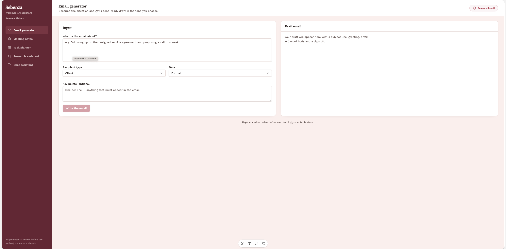
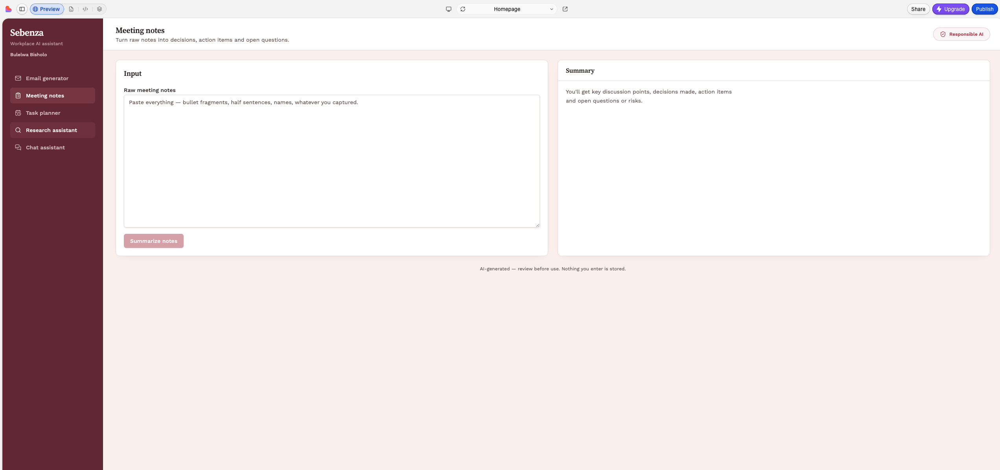
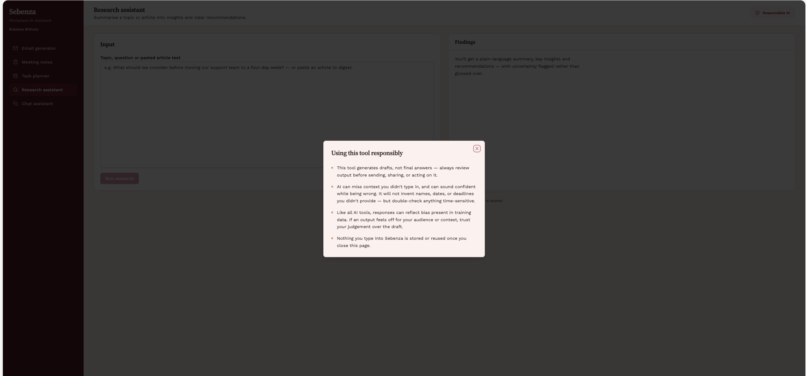

# Sebenza — AI-Powered Workplace Productivity Assistant

*"Sebenza"* is isiXhosa/isiZulu for **work**. This is an AI dashboard that helps professionals get through the small, repetitive tasks that eat a working day — drafting emails, making sense of meeting notes, planning a schedule, digesting research, and getting a quick answer from an assistant that knows the context of a workplace.

Built for the **CAPACITI AI Skill Accelerator Programme**, by Bulelwa Bisholo.

---

## Live demo

This project was built with [Lovable](https://lovable.dev).

**Live app**: https://sebenza-app.lovable.app

---

## Problem statement

Professionals across industries spend significant time on repetitive tasks — drafting emails, summarizing information, planning schedules, and researching topics. Sebenza puts five focused AI tools behind one dashboard so those tasks take minutes instead of a scattered afternoon.

## Features

| Tool | What it does |
|---|---|
| **Smart Email Generator** | Drafts a ready-to-send email from a short description, matched to recipient (client, manager, team, external partner) and tone (formal, friendly, persuasive). |
| **Meeting Notes Summarizer** | Turns raw, messy notes into key discussion points, decisions made, action items (with owner and deadline where stated), and open questions. |
| **AI Task Planner / Scheduler** | Orders a task list by urgency and importance and builds a daily or weekly time-blocked plan. |
| **AI Research Assistant** | Summarizes a topic or pasted article into a plain-language summary, key insights, and recommendations. |
| **AI Chatbot Interface** | A general workplace assistant for quick questions that don't fit the other four tools, with running conversation history. |

## Design

Dashboard layout with a fixed sidebar for navigation between the five tools, an input/output split for every tool, and a persistent **Responsible AI** button in the header that opens a plain-language explanation of the tool's limits — not just a footer disclaimer. Blush pink and deep rose palette, chosen to feel professional and premium rather than decorative. Fully responsive: the sidebar collapses to a mobile menu and the input/output panels stack vertically on small screens.

## Tools used

- **Claude (Anthropic)** — powers all five AI features via the Messages API
- **lovable.ai** — build environment and hosting, with the API key held server-side rather than in the browser
- **GitHub** — version control and submission

## Sample prompts

Each feature runs on its own system prompt with a fixed output structure and an explicit instruction against fabricating information. One example, from the Meeting Notes Summarizer:

```
You are a meeting-notes summarizer inside a workplace productivity tool.
Given raw, possibly messy meeting notes, produce a structured summary in
plain text with exactly these four headings: 'Key discussion points',
'Decisions made', 'Action items', 'Open questions or risks'. For each
action item write it as 'Owner (or Unassigned): task — deadline (or No
deadline given)'. Do not invent owners, deadlines, or decisions that are
not clearly stated or clearly implied by the notes.
```

The remaining four prompts (Email Generator, Task Planner, Research Assistant, Chatbot) follow the same pattern and are documented in full in `Sebenza_Documentation.docx`.

## Responsible AI

Sebenza is a decision-support tool, not a decision-maker:

- Outputs are drafts. Review before sending, sharing, or acting on anything.
- The model won't invent names, dates, or deadlines that weren't provided — it flags what's missing instead of guessing.
- Like any AI tool, responses can reflect bias present in training data; trust your own judgement over the draft when something feels off.
- Nothing entered into the tool is stored beyond the session.

This is surfaced directly in the product via the Responsible AI button, not only in this document.

## Challenges and solutions

- **Keeping AI output honest rather than confidently invented** — every system prompt explicitly instructs the model to use placeholders or say "not specified" instead of guessing.
- **Making the tool usable, not just a text box** — each feature has structured inputs (recipient type, tone, schedule type, time available) so the prompt always has enough context for a usable first draft.
- **Client-side prototypes can't safely hold an API key for public deployment** — the working prototype was first built and demonstrated in a secured environment; the public-facing build uses lovable.ai's backend function so the key is never exposed in the browser.

## Screenshots

**Email generator** — dashboard layout with sidebar navigation, input/output split, and the persistent Responsible AI button in the header.



**Meeting notes summarizer** — the same input/output structure applied to raw meeting notes.



**Responsible AI panel** — opened from the header button on any screen (shown here over the Research assistant tool), giving plain-language guidance rather than a buried disclaimer.



---

*CAPACITI AI Skill Accelerator Programme — AI-Powered Workplace Productivity Assistant project.*
